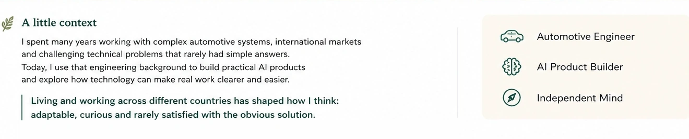
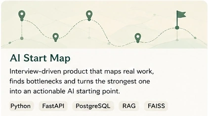
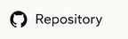
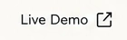
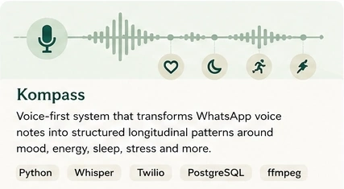
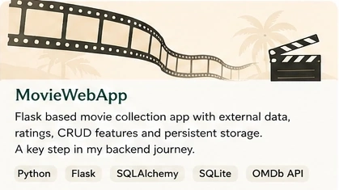
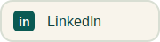

  

 

  

 

  

<table role="presentation">
  <tr>
    <td width="33.33%" align="center" valign="top">
      
       
      
      
    </td>
    <td width="33.33%" align="center" valign="top">
      
       
      
      
    </td>
    <td width="33.33%" align="center" valign="top">
      
       
      
      
    </td>
  </tr>
</table>

 

  

 

  <strong>I think in connections, move between worlds and build with purpose.</strong>

 

  

 

  
  &nbsp;
  
  &nbsp;
  

