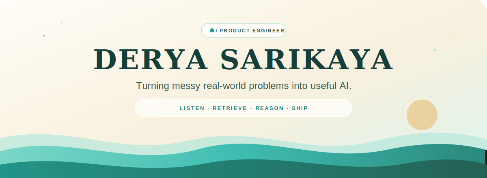

<!-- Profile repository: https://github.com/deryasarikaya/deryasarikaya -->

  

   
  
    
  
  

 

## Building from the problem outward

I'm an engineer moving deeper into AI, focused on products that solve real business problems. I like finding the stubborn part of a workflow, understanding what people actually need, and building the smallest system that makes it meaningfully better—from voice interfaces and retrieval pipelines to APIs, databases, and the details that make software dependable.

 

## Selected work

<table width="100%">
  <tr>
    <td colspan="2" valign="top">
      <h3><a href="https://github.com/deryasarikaya/AI-Start-Map">AI Start Map</a></h3>
      
<strong>From a vague operational problem to a concrete automation blueprint.</strong>

      
An interview-driven product for solo founders and small businesses. It maps a real process, isolates the bottleneck, ranks three useful automation opportunities, and turns the strongest one into an actionable blueprint.

      

        <code>Python</code>&nbsp; <code>FastAPI</code>&nbsp; <code>PostgreSQL</code>&nbsp; <code>OpenAI</code>&nbsp; <code>RAG</code>&nbsp; <code>FAISS</code>
      

      

        
        
      

    </td>
  </tr>
  <tr>
    <td width="50%" valign="top">
      <h3><a href="https://github.com/deryasarikaya/Kompass">Kompass</a></h3>
      
<strong>A voice-first AI companion built around honest patterns.</strong>

      
Turns WhatsApp voice notes into structured life and health signals, then surfaces explainable correlations over time. Designed with explicit safety guardrails, privacy, and uncertainty thresholds—not invented certainty.

      

        <code>Flask</code>&nbsp; <code>Whisper</code>&nbsp; <code>PostgreSQL</code>&nbsp; <code>Twilio</code>&nbsp; <code>Streamlit</code>
      

      

        
        
      

    </td>
    <td width="50%" valign="top">
      <h3><a href="https://github.com/deryasarikaya/MoviWebApp">MovieWebApp</a></h3>
      
<strong>A polished movie collection manager, ready to explore.</strong>

      
A responsive Flask application for creating personal collections, importing movie data from OMDb, and adding personal ratings. Includes seeded demo content and a live deployment for frictionless evaluation.

      

        <code>Flask</code>&nbsp; <code>SQLAlchemy</code>&nbsp; <code>SQLite</code>&nbsp; <code>OMDb API</code>&nbsp; <code>Render</code>
      

      

        
        
      

    </td>
  </tr>
</table>

 

## Current focus

<table width="100%">
  <tr>
    <td width="33%" valign="top"><strong>Agentic AI</strong> Reliable multi-step systems that can use tools and recover gracefully.</td>
    <td width="33%" valign="top"><strong>RAG</strong> Grounded answers built from curated, traceable knowledge.</td>
    <td width="33%" valign="top"><strong>Voice AI</strong> Natural input transformed into useful, structured action.</td>
  </tr>
  <tr>
    <td width="33%" valign="top"><strong>AWS</strong> Cloud foundations for products that need to leave localhost.</td>
    <td width="33%" valign="top"><strong>FastAPI</strong> Typed, focused services with clean boundaries.</td>
    <td width="33%" valign="top"><strong>PostgreSQL</strong> Durable data models for systems that learn over time.</td>
  </tr>
</table>

 

## Tools I build with

  

    
    
    
    
    
  

  

    
    
    
    
    
  

  

    
    
    
    
  

 

## The work, in motion

  

  
  

 

## A simple philosophy

<table width="100%">
  <tr>
    <td align="center">
       
      <strong>I enjoy building AI that feels genuinely useful.</strong>
        
      Less hype. More real-world impact.
        
    </td>
  </tr>
</table>

 

## Find me

  
  
  
  

 

  Built with curiosity, care, and a preference for useful things.

