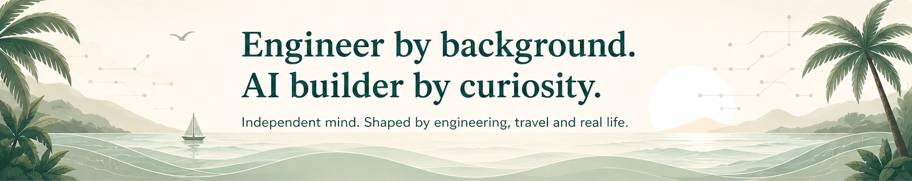
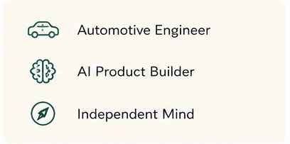
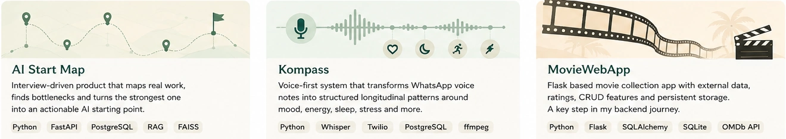
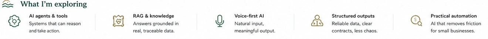

  

 

<table role="presentation">
  <tr>
    <td width="66%" valign="top">
      <h2>🌿 A little context</h2>
      
I spent many years working with complex automotive systems, international markets and technical problems that rarely had simple answers.

      
Today, I use that engineering background to build practical AI products and explore how technology can make real work clearer and easier.

      
<strong>Living and working across different countries has shaped how I think: adaptable, curious and rarely satisfied with the obvious solution.</strong>

      
<strong>I think in connections, move between worlds and rarely follow the obvious path.</strong>

    </td>
    <td width="34%" align="center" valign="top">
      
    </td>
  </tr>
</table>

## 🌴 Selected projects

  

  <strong>AI Start Map</strong> · <a href="https://github.com/deryasarikaya/AI-Start-Map">Repository →</a>  
  <strong>Kompass</strong> · <a href="https://github.com/deryasarikaya/Kompass">Repository →</a>  
  <strong>MovieWebApp</strong> · <a href="https://github.com/deryasarikaya/MoviWebApp">Repository →</a>
  &nbsp; · &nbsp;
  <a href="https://moviwebapp-1lej.onrender.com">Live Demo →</a>

## ≋ What I’m exploring

  

Exploring how useful AI systems can become more adaptive, more reliable and easier for real people to use.

 

  <strong>I think in connections, move between worlds and build with purpose.</strong>

 

  

 

  <a href="https://www.linkedin.com/in/deryasarikaya">LinkedIn</a>
  &nbsp; · &nbsp;
  <a href="https://deryasarikaya.ai">Website</a>
  &nbsp; · &nbsp;
  <a href="mailto:deryaxsarikaya@gmail.com">Email</a>
  &nbsp; · &nbsp;
  <a href="https://github.com/deryasarikaya?tab=repositories">Repositories</a>

