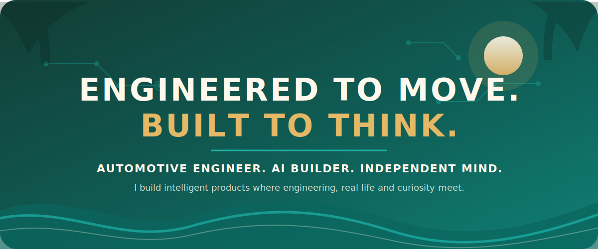
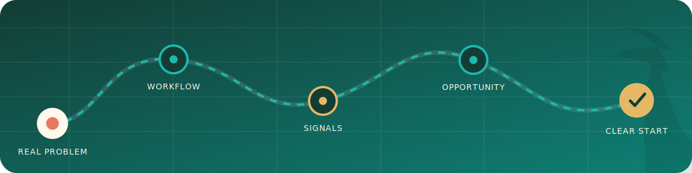
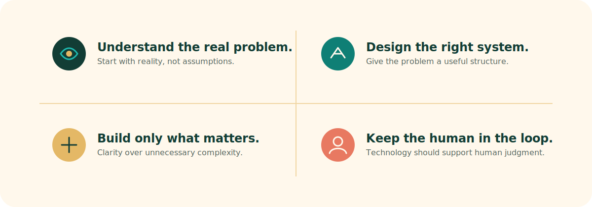
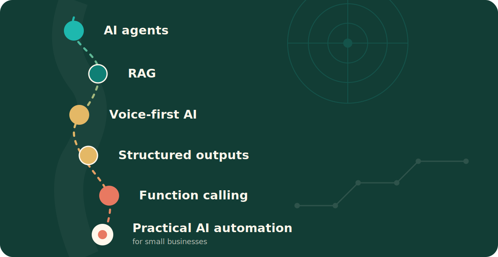
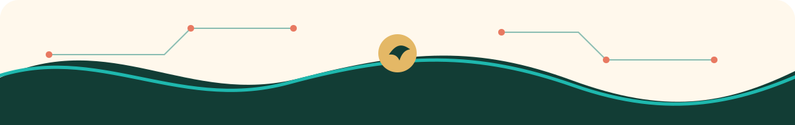

  

 

## NOT THE USUAL PATH.

I spent years inside the automotive world, working with complex systems, technical problems and people across international markets.

Today, I bring that engineering mindset into AI.

I am interested in the space between a vague real-world problem and a system that finally makes sense — technically, practically and humanly.

I do not build AI to look impressive.

I build it to make something clearer, easier or genuinely more useful.

  

 

## THINGS I’M BRINGING TO LIFE.

  

### AI Start Map

**From “something here is not working” to a clear AI starting point.**

AI Start Map interviews small-business owners about their daily work, reconstructs the real workflow behind their answers and identifies practical opportunities for AI and automation.

The system is designed to separate attractive ideas from genuinely useful starting points.

`Python` · `FastAPI` · `PostgreSQL` · `OpenAI API` · `RAG` · `FAISS`

[Explore the repository →](https://github.com/deryasarikaya/AI-Start-Map)

 

  

### Kompass

**A voice-first system for discovering patterns hidden inside everyday life.**

Kompass transforms natural WhatsApp voice messages into structured longitudinal data across mood, energy, sleep, stress, symptoms and daily events.

It is designed around explainable patterns, thoughtful follow-up questions, privacy and clear safety boundaries.

`Python` · `Whisper` · `Twilio` · `PostgreSQL` · `ffmpeg` · `OpenAI API`

[Explore the repository →](https://github.com/deryasarikaya/Kompass)

 

  

### MovieWebApp

**A finished web application built to understand how backend systems work together.**

A Flask-based movie collection application with external movie data, personal ratings, CRUD functionality and persistent storage.

This project represents an important completed step in my transition from engineering systems to building software systems.

`Python` · `Flask` · `SQLAlchemy` · `SQLite` · `Jinja2` · `OMDb API` · `Render`

[Explore the repository →](https://github.com/deryasarikaya/MoviWebApp) &nbsp;·&nbsp; [Open the live application →](https://moviwebapp-1lej.onrender.com)

 

## THE THREAD THROUGH EVERYTHING.

My projects may look different, but they begin in the same place:

A real person.  
A complicated situation.  
Too much friction.  
And the question of whether technology can make it better without making it colder.

  

 

## WHERE I’M GOING NEXT.

  

Exploring how useful AI systems can become more adaptive, more reliable and easier for real people to use.

 

  
  
<strong>Built with engineering discipline, tropical curiosity and a refusal to make technology more complicated than it needs to be.</strong>

  
<strong>Derya Sarikaya</strong> Automotive Engineer × AI Builder × Free Mind

  

    <a href="https://www.linkedin.com/in/deryasarikaya">LinkedIn</a>
    &nbsp; · &nbsp;
    <a href="https://deryasarikaya.ai">Personal website</a>
    &nbsp; · &nbsp;
    <a href="mailto:deryaxsarikaya@gmail.com">Email</a>
    &nbsp; · &nbsp;
    <a href="https://github.com/deryasarikaya?tab=repositories">GitHub repositories</a>
  

